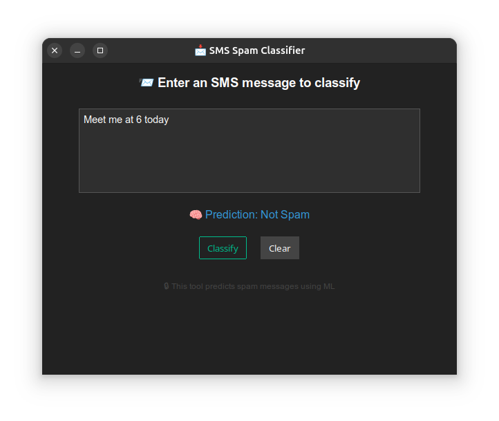
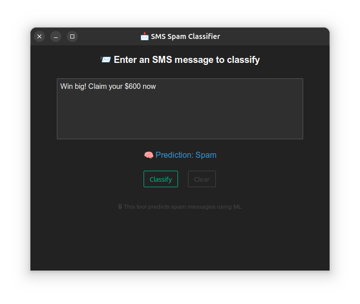

# 🧠 SMS Spam Classifier

This project implements a machine learning-based **SMS Spam Classifier** using Python. It includes data preprocessing, feature extraction with TF-IDF, model training with Logistic Regression, performance evaluation, and a GUI for real-time spam detection using 'ttkbootstrap'.

---

## 🚀 Features

- Data cleaning and tokenization
- Stopword removal and TF-IDF vectorization
- Spam vs Ham classification using Logistic Regression
- Confusion matrix and performance metrics
- Beautiful GUI for message classification

---

## 📂 Dataset

- Dataset used: SMS Spam Collection (tab-separated file)
- Columns: 'label' (ham/spam), 'message'

---

## 🛠️ Tech Stack

- Python 3.x
- Pandas, NumPy
- Scikit-learn
- Matplotlib, Seaborn
- NLTK (for text preprocessing)
- ttkbootstrap (for GUI)

---

## 📊 Visualizations

- Count plot of Spam vs Ham
- Confusion matrix for model evaluation

---

## 🧪 Evaluation Metrics

- Accuracy, Precision, Recall, F1-Score
- Classification Report and Confusion Matrix

---

## spam_env for virtual python environment setup

---

## Examples / Snapshots
- Not Spam



- Spam\



---

## 🧰 Installation

1. Clone the repository:
   ```bash
   git clone https://github.com/Kanishkjain0510/Spam_Classifier.git
   cd Huffman-Encoding
